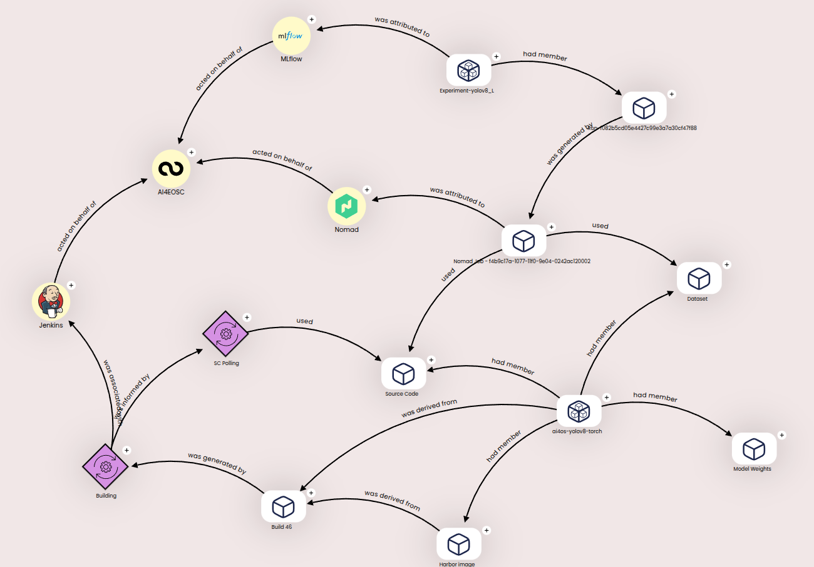

# ai4-prov-viz

Provenance Visualizer is a web tool that brings the user the oppotunity to explore the metadata of an AI4EOSC module.

After parsing the provenance rdf's generated by [Provenance API](https://github.com/ai4os/ai4-prov-api), the visualizer generates a graph with D3js.
The UI is made with React.